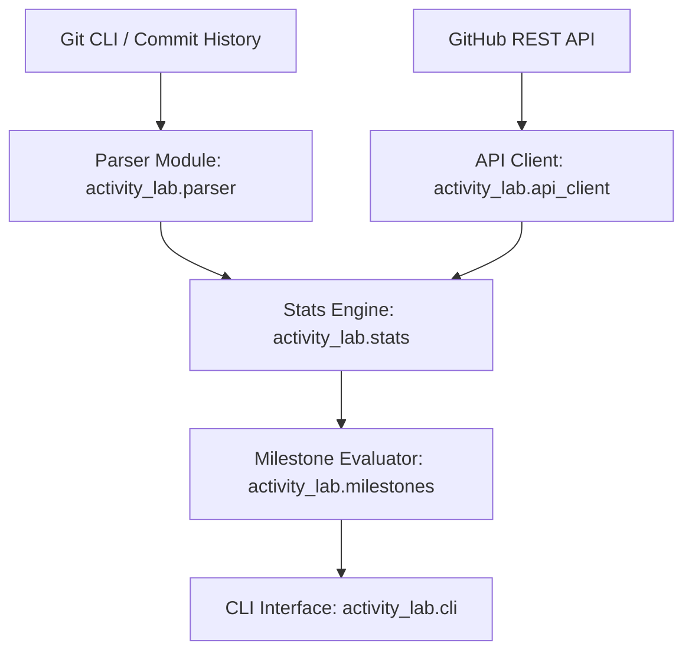

# System Architecture

## Overview

`github-activity-lab` is built as a zero-dependency, modular Python toolkit that operates across both local Git storage and GitHub REST endpoints.

## Core Modules

### 1. `activity_lab.parser`
- Inspects commit log streams or individual commit messages.
- Employs strict RFC regex validation to extract standard trailers such as `Co-authored-by:` and generic key-value trailers.
- Isolates trailer candidate lines from the last paragraph of the commit message to prevent false positives with conventional commit prefixes (`feat:`, `fix:`).

### 2. `activity_lab.stats`
- Computes aggregate metrics from parsed commits.
- Aggregates primary commits, co-authored contributions, and unique contributors.
- Calculates co-authorship percentages to reflect collaborative health.

### 3. `activity_lab.milestones`
- Implements current specifications for GitHub Achievements.
- Evaluates tier boundaries (`Default`, `Bronze`, `Silver`, `Gold`).
- Returns structured progress indicators highlighting exact counts required for subsequent tiers.

### 4. `activity_lab.api_client`
- Standard library (`urllib.request`) client for GitHub API.
- Handles authentication headers, pagination metadata, and structured error responses without requiring third-party libraries.
